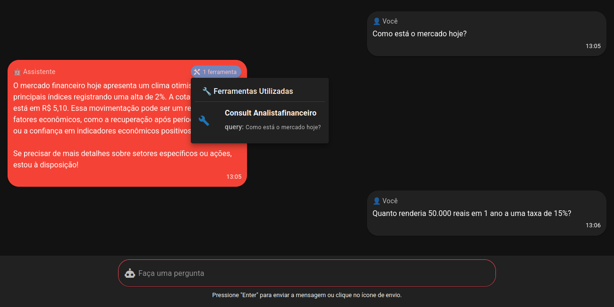

# Hermes-Web

[](https://choosealicense.com/licenses/mit/)
[](https://vuejs.org/)
[](https://vuetifyjs.com/)
[](https://developer.mozilla.org/en-US/docs/Web/JavaScript)
[](https://vitejs.dev/)
[](https://github.com/your-repo/hermes)
[](https://nodejs.org/)

🤖 A modern web interface for testing and interacting with agents from the Hermes Python library. This application provides an intuitive and responsive chat interface for AI agent communication. ✨

## 🖼️ Screenshots


*Main chat interface with conversation history*


*Visualization of tools used by agents*


*Message input interface with validation*


*Loading indicator during processing*

## ✨ Features

- 💬 **Intuitive Chat Interface**: Real-time chat with modern and responsive design
- 🛠️ **Tool Visualization**: Displays tools used by agents with parameter details
- ⏰ **History with Timestamps**: Track complete conversation history with timestamps
- 🔄 **State Indicators**: Loading states and real-time error handling
- 📱 **Responsive Design**: Adaptive interface for different screen sizes
- ⚠️ **Data Protection**: Alert before leaving page to prevent history loss

## 🚀 Technologies Used

- **Vue 3** - Reactive JavaScript framework
- **Vuetify 3** - Material Design component framework
- **Axios** - HTTP client for API communication
- **Vite** - Modern and fast build tool

## 📋 Prerequisites

- Node.js (version 16 or higher)
- Hermes library backend running on `http://localhost:8000`

## 💿 Installation

1. Clone the repository:
```bash
git clone <repository-url>
cd hermes_web
```

2. Install dependencies:
```bash
npm install
# or
yarn install
# or
pnpm install
# or
bun install
```

## 🚀 Usage

### Development

To start the development server:

```bash
npm run dev
# or
yarn dev
# or
pnpm dev
# or
bun dev
```

The application will be available at [http://localhost:3000](http://localhost:3000)

### Production

To build for production:

```bash
npm run build
# or
yarn build
# or
pnpm build
# or
bun build
```

## 🔧 API Configuration

The application is configured to communicate with the backend at `http://localhost:8000`. To change this URL, modify the axios configuration in the component:

```javascript
const api = axios.create({
    baseURL: 'http://localhost:8000', // Change here
    headers: {
        'Content-Type': 'application/json',
    },
    timeout: 30000
})
```

## 📡 API Structure

The application expects the backend to provide a `/chat` endpoint that accepts:

**Request:**
```json
{
  "message": "string",
  "chat_history": [
    {
      "role": "user|assistant",
      "content": "string"
    }
  ]
}
```

**Response:**
```json
{
  "response": {
    "blocks": [
      {
        "block_type": "text",
        "text": "string"
      }
    ]
  },
  "tool_calls": [
    {
      "tool_name": "string",
      "tool_kwargs": {}
    }
  ],
  "current_agent_name": "string"
}
```

## 🎨 Customization

The design uses red color palette (`#ff4759`) as the main theme. To customize:

1. Modify color classes in Vuetify components
2. Adjust CSS variables in component `<style>`
3. Customize icons and texts as needed

## 📄 License

[MIT](http://opensource.org/licenses/MIT)

Copyright (c) 2025 Hermes-Web

